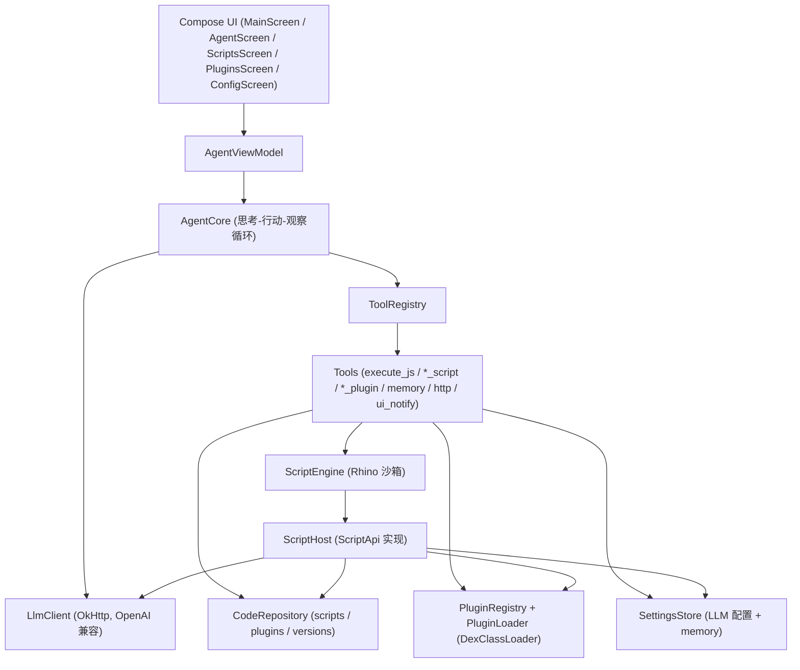

# SelfMod Agent

一个运行在 Android 应用内部的 LLM 智能体，能够**在运行时修改自身行为**：它可以在应用沙箱里执行 JavaScript、编辑并版本化自己的脚本，还能通过 `DexClassLoader` 热加载 `.dex` 插件。整个"思考—行动—观察"循环与副作用都对用户可见。

> 设计取向：能力全部显式暴露、可审计、可回滚。没有隐藏的反射逃逸，脚本只能通过一个很窄的 `ScriptApi` 接口触达系统能力。

## 功能特性

- 对话式智能体：OpenAI 兼容的 `chat/completions` + function calling，多轮工具循环。
- 离线推理：可切换到设备端本地模型（MediaPipe / MNN），无需联网，断电可用。
- 自改代码：内置 JS 脚本仓库，每次写入自动快照，可列版本、可回滚。
- 脚本沙箱：Mozilla Rhino，`initSafeStandardObjects`，脚本无法通过反射访问任意 Java 类。
- 动态插件：从 base64 安装 `.dex`，运行时加载并调用实现 `SelfModPlugin` 的类。
- 持久记忆：键值存储，重启后保留。
- 联网工具：`http_get` / `http_post`，供智能体拉取外部数据或新的逻辑模块。
- 可视化轨迹：思考、行动、观察、答复、UI 事件分色展示。

## 离线推理（本地模型，速度对齐 MNN Chat）

应用有三种后端，在「配置」页切换：

| 后端 | 说明 | 工具调用方式 |
| --- | --- | --- |
| 远程 API | OpenAI 兼容 `chat/completions` | 原生 function calling |
| 本地 · MediaPipe | `com.google.mediapipe:tasks-genai`，GPU/CPU | 文本 ReAct 协议 |
| 本地 · MNN | MNN-LLM 引擎（对齐 MNN Chat） | 文本 ReAct 协议 |

本地小模型不支持原生 function calling，因此本地后端走一套**文本 ReAct 协议**：系统提示要求模型输出 `Thought / Action / Action Input` 或 `Thought / Final Answer`，由 `ReActParser` 解析成工具调用或最终答复。`PromptFormatter` 按引擎套用 Gemma 或 ChatML 模板。

### 为什么"快"

- GPU 加速：MediaPipe 优先 GPU 后端，MNN 走 OpenCL。
- 低内存：MNN 编译开启 `MNN_LOW_MEMORY` / `MNN_CPU_WEIGHT_DEQUANT_GEMM`，mmap 权重映射。
- 会话复用：模型只在首次加载时映射权重，之后常驻；配置页可手动卸载释放内存。
- 流式输出：token 逐字回调到 UI 轨迹。

### MediaPipe（开箱可用）

`com.google.mediapipe:tasks-genai` 已在依赖中（Google Maven），只打包 `arm64-v8a`。准备一个 `.task`/`.bin` 模型（如 Gemma 2B），在配置页填绝对路径即可。GPU 后端首次加载需要 2-3 秒做 shader 编译，之后推理很快。

### MNN（需自行编译原生库）

MNN 官方不提供 AAR，需要自己用 NDK 编译，产物放到 `app/src/main/jniLibs/arm64-v8a/`：

```bash
export ANDROID_NDK=$YOUR_NDK
git clone https://github.com/alibaba/MNN
cd MNN/project/android && mkdir build_64 && cd build_64
../build_64.sh "-DMNN_BUILD_LLM=true -DMNN_ARM82=true -DMNN_LOW_MEMORY=true \
  -DMNN_CPU_WEIGHT_DEQUANT_GEMM=true -DMNN_SUPPORT_TRANSFORMER_FUSE=true \
  -DMNN_OPENCL=true -DMNN_USE_LOGCAT=true -DCMAKE_INSTALL_PREFIX=."
make install
```

把生成的 `libMNN.so`、`libMNN_LLM.so` 与 JNI 胶水库 `libmnnllm_jni.so` 一起放进 `jniLibs`。缺少这些库时 `MnnEngine.isAvailable` 为 false，应用不会崩溃，只是该后端不可选。

> MNN 目录模型填**目录**路径（含 `config.json` 与权重）；MediaPipe 填**单个文件**路径。

## 架构



## 模块说明

| 模块 | 路径 | 职责 |
| --- | --- | --- |
| 应用入口与装配 | `app/src/main/java/com/selfmod/agent/App.kt` | 在 `Application` 里以纯手工方式装配所有单例（无 DI 框架），并向 UI 暴露事件流 |
| 智能体循环 | `agent/AgentCore.kt` | 维护对话历史，调用 LLM，分发工具调用，直到模型不再请求工具或达到步数上限 |
| 工具注册 | `agent/ToolRegistry.kt`、`agent/Tools.kt` | 所有设备侧能力的唯一入口，每个工具一份 JSON schema |
| 提示模板 | `agent/PromptTemplates.kt` | 系统提示与 `AgentStep` 事件定义 |
| LLM 客户端 | `llm/LlmClient.kt`、`llm/LlmConfig.kt`、`llm/Messages.kt` | 同步 OpenAI 兼容客户端与配置预设 |
| 脚本沙箱 | `script/ScriptEngine.kt`、`script/ScriptApi.kt`、`script/ScriptHost.kt` | Rhino 执行、受限 API 接口、Android 实现 |
| 代码仓库 | `repo/CodeRepository.kt`、`repo/Version.kt` | 脚本与 dex 的落盘存储及版本快照 |
| 插件系统 | `plugin/PluginLoader.kt`、`plugin/PluginRegistry.kt`、`plugin/SelfModPlugin.kt` | `.dex` 加载、缓存、调用契约 |
| 持久化 | `store/SettingsStore.kt` | SharedPreferences：LLM 配置 + 记忆键值 |
| UI | `ui/`、`ui/theme/` | Compose 界面与配色 |
| 工具函数 | `util/JsonUtil.kt` | `org.json` 薄封装 |

## 环境要求

- JDK 17
- Android SDK（`compileSdk = 34`，`minSdk = 26`，`targetSdk = 34`）
- Gradle 通过 wrapper 使用（`./gradlew`），无需单独安装

## 构建与运行

```bash
# 设置 Android SDK 路径（或设置 ANDROID_HOME 环境变量）
echo "sdk.dir=/path/to/Android/Sdk" > local.properties

# 构建 debug APK
./gradlew assembleDebug

# 安装到已连接设备
./gradlew installDebug
```

产物位于 `app/build/outputs/apk/debug/app-debug.apk`。

> 若处于受限网络环境，Gradle 的代理配置位于 `gradle.properties` 的 `systemProp.*` 项。

## 使用

1. 打开 App，进入「配置」页。
2. 选择预设（GLM / DeepSeek / Moonshot / OpenAI）或手填 `Base URL`、`API Key`、模型名，保存。
3. 回到「智能体」页，用自然语言下达任务。智能体会以工具调用驱动脚本、插件与联网能力。
4. 「脚本」页可手动编辑、运行、回滚脚本；「插件」页可加载、卸载、删除已安装插件。

> API Key 仅保存在本机应用私有 SharedPreferences 中，不会外传。

## 脚本沙箱

智能体用 `execute_js` 工具执行 JS；脚本也可从「脚本」页手动运行。沙箱内预置以下全局对象：

| 全局 | 方法 | 说明 |
| --- | --- | --- |
| `api` | 全部能力 | 下面所有对象的底层接口 |
| `log` | `log(...)` | 记录日志，返回给调用方 |
| `toast` | `toast(msg)` | 弹出 Android Toast |
| `http` | `http.get(url, headers?)` / `http.post(url, body, headers?)` | HTTP 请求 |
| `llm` | `llm.ask(prompt)` / `llm.chat(messagesJson)` | 调用同一个大模型 |
| `store` | `store.get(k)` / `store.set(k, v)` | 持久记忆 |
| `scripts` | `scripts.read(n)` / `scripts.write(n, c)` / `scripts.list()` | 读写脚本仓库 |
| `plugins` | `plugins.load(n)` / `plugins.list()` | 插件操作 |
| `ui` | `ui.notify(action, payload)` | 向 UI 推送事件 |
| `now` | `now()` | 当前毫秒时间戳 |

内置示例见 `app/src/main/assets/scripts/hello.js` 与 `demo.js`。

## 插件开发

插件是一个 `.dex` 文件，外加一个同名的 `<name>.entry` 文本文件（内容是入口类的全限定名）。入口类必须是 public、无参构造，并实现：

```kotlin
package com.selfmod.agent.plugin

interface SelfModPlugin {
    val id: String
    val version: Int
    fun describe(): String
    fun invoke(action: String, payload: String): String
}
```

智能体通过 `install_plugin` 工具以 base64 安装：

```json
{
  "name": "myplugin",
  "entry": "com.example.MyPlugin",
  "dex_b64": "<dex 的 base64>",
  "load": true
}
```

安装后可用 `load_plugin` / `invoke_plugin` / `unload_plugin` 管理。

> 注意：自 Android 14（API 34）起，`DexClassLoader` 不允许加载可写的 dex 文件。`CodeRepository.installPlugin` 会在写入后把 dex 置为只读，以规避 `SecurityException: Writable dex file ... is not allowed`。

## 安全边界

- 脚本运行在 Rhino 的 `initSafeStandardObjects` 作用域中，无法通过反射触达任意 Java 类。
- 脚本能做的事严格限定在 `ScriptApi` 暴露的方法内。
- 破坏性操作（删除脚本、安装插件）在系统提示中被要求先通过 `ui_notify` 声明意图。
- 建议仅在调试/自用设备上运行，并谨慎使用 `install_plugin`。

## 已知限制

- 对话历史保存在内存中，进程被回收后清空（脚本与插件不受影响）。
- 单个任务最多 12 轮工具循环（见 `AgentCore.MAX_ITERATIONS`）。
- 工具观察结果超过 6000 字符会被截断后写入历史。
- 未处理推理模型单独的 `reasoning_content` 字段。
